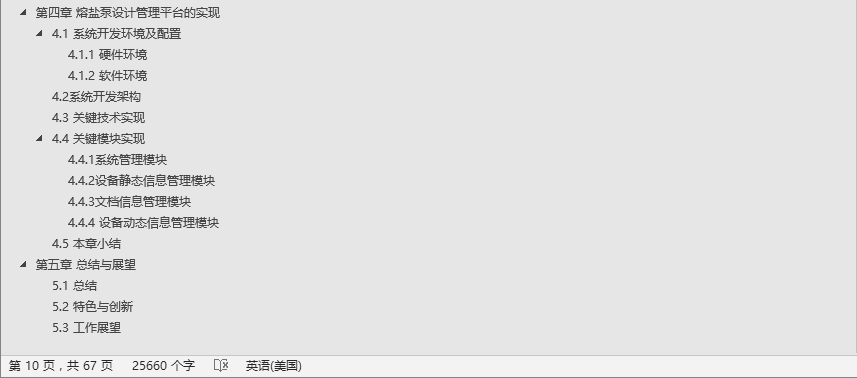

#20190412组会工作汇报
##
### 1.主要进展
任务|完成情况
--|:--:|--:
SFO变量列表 数据库及页面列表检索上线|完成100%
SFOIP地址分配  数据库及页面上线|完成100%
SFO端口信息 数据库及页面列表检索上线|完成80%
SFO变量列表 链接历史数据 上线|完成100%
SF0设备信息查询 上线|完成0%
  
 **未完成的20%：** *表格整理尚未全部整理完，数据尚未全部导入数据库*

### 2.成果展示
[SF0技术支持网站](192.168.10.9:3000)

###3.遇到的问题
    1.Postgresql数据库以用户postgres无法登陆
    解决->配置 访问认证规则

pg_hba.conf： 
`host all all 0.0.0.0/0 trust`

**trust表示信任无需密码；MD5表示需要加密口令认证；reject表示无条件拒绝；password口令以明文方式传输；ident获取客户的操作系统名然后检查游戏iakankan用户是否允许以要求的额数据库用户进行连接**

 ①host:表示链接iefangshi，有三种local、host、hostssl
 ②all：数据库
 ③all:用户名
④0.0.0.0/0:ip地址/掩码值
⑤trust:认证方法

    2.postgresql 数据库中数据的导入导出
`pg_dump -U postgres -t 数据库名  > 保存文件目录./test.bak`

`psql -d newdatabase -U postgres -f `
*mydatabase.bak(或者pgadmin客户端导入)*

    3.node版本过低导致项目启动报错

### 4.论文情况

### 5.下周安排
任务|计划情况
--|:--:|--:
SFO端口信息 数据库及页面列表检索上线|完成余下20%
SF0设备信息查询 上线|完成余下100%
大论文修改&查重|完成100%